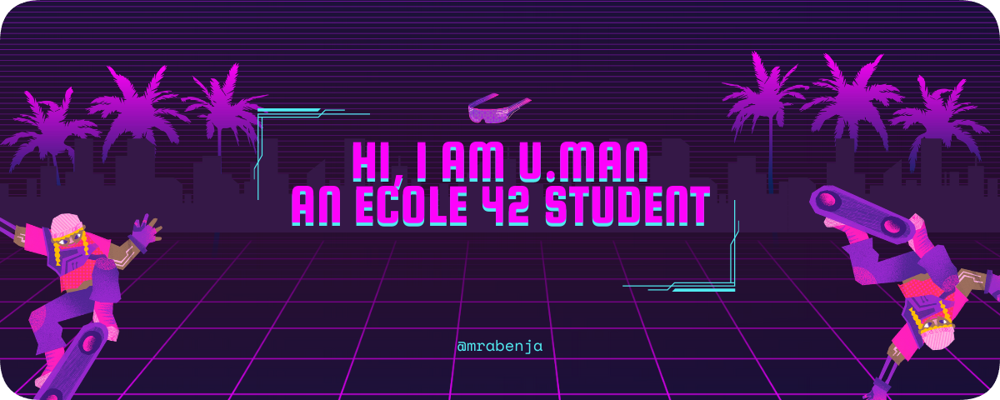
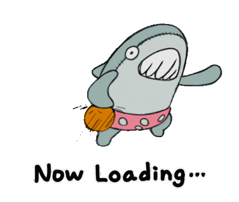
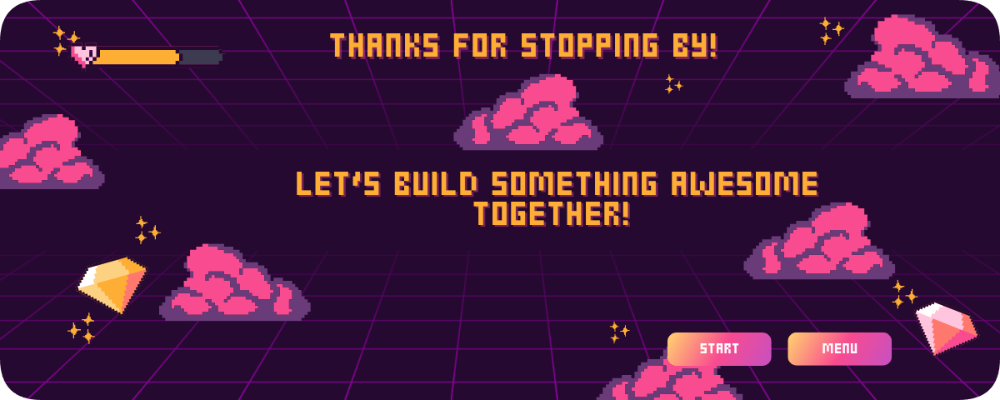

# 👨‍💻 NingenUman | Aspiring Code Craftsman

  

<h3 align="center">🌟 A passionate dabbler coder, navigating the tech universe at 42, nearing the finish line of the Common Core!</h3>

---

## 🚀 About Me

Hey there! I'm a curious coder-in-training at [42](https://www.42.fr/), diving deep into the art & science of programming. I love experimenting with code, learning new tech, and building projects that spark joy and solve problems. When I'm not debugging or dreaming in C++, you can find me exploring the vast world of tech or sketching ideas for my next big project.

- 🌱 **Currently mastering**: Networking, System Administration, and C++
- 💡 **Passionate about**: Creating efficient, elegant solutions and learning new tools
- 📫 **Reach me at**: [manoarabenja@gmail.com](mailto:manoarabenja@gmail.com)
- 🎯 **Goal**: To craft impactful software and leave a mark in the tech world

---

## 🎯 Recent Contributions

  

  <em>🤸🏼Watch my coding journey unfold through my GitHub activity!🤸🏼</em>

---

## ⏳ 42 Cursus Progress

  

  <em>Grinding through the 42 Common Core — almost there! 🚀</em>

---

## 🛠️ Skills & Tools

Here’s the tech stack I’m wielding and sharpening:

  
  
  
  
  
  
  
  
  
  
  
  
  
  
  

---

## 📂 Featured Projects

Here are a few projects I'm proud of from my 42 journey and beyond:

- **[Cub3D]**  
  *Description*: A C based project where you build a Wolfenstein 3D like game, focusing on raycasting and rendering.  
  *Tech Stack*: C, Makefile, Minilibx
  *Repo*: [https://github.com/MickFurax/cub3d]

- **[so_long]**  
  *Description*: A C based project where you create a 2D game, using Minilibx.  
  *Tech Stack*: C, Makefile, Minilibx  
  *Repo*: [https://github.com/NingenUman/so_long42]

*Want to see more? Check out my [Repositories](https://github.com/NingenUman?tab=repositories)!*

---

## 📱 Connect with Me

Let's geek out together! Find me on:

  
  
  

---

## 🌟 Fun Facts

- 🕹️ I’m a fan of retro gaming and sometimes code mini-games for fun!
- ☕ Coffee is my coding fuel — black, no sugar.
- 📚 Always reading up on the latest tech trends to stay ahead of the curve.

 
 
 

  

  <em>May our code carve a tranquil path to tomorrow’s light. 🕉️</em>

